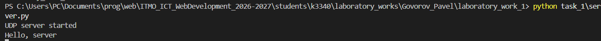
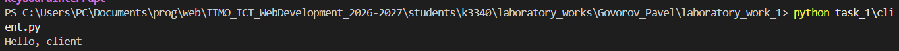
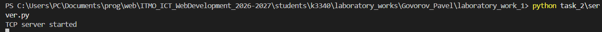
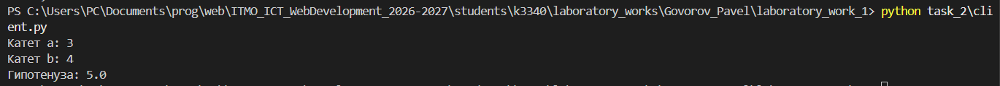
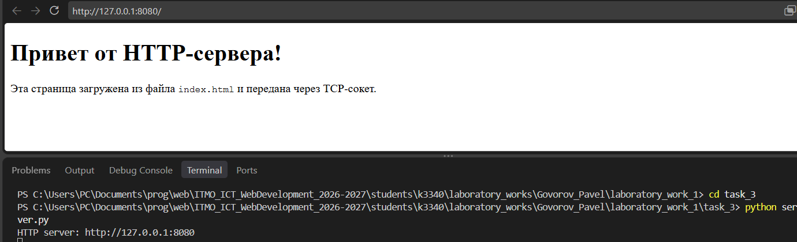
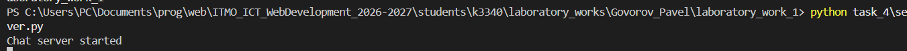
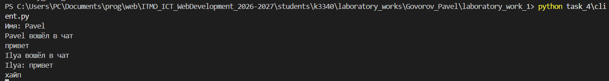
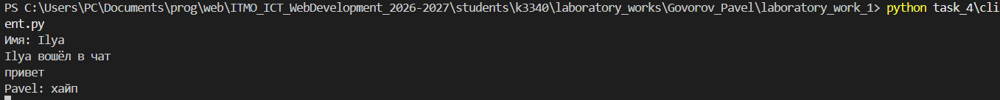
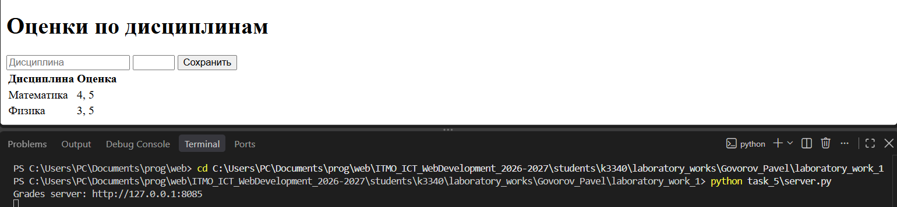

# Лабораторная работа №1. Работа с сокетами

**Студент:** Govorov Pavel

**Группа:** K3340

**Вариант:** 1

## Цель работы

Освоить создание клиентских и серверных приложений с использованием `socket`, протоколов UDP и TCP, HTTP-запросов и многопоточности.

Исходный код находится в `students/k3340/laboratory_works/Govorov_Pavel/laboratory_work_1/`.

## Задание 1. UDP-обмен

Клиент отправляет серверу сообщение `Hello, server`, сервер выводит его и отвечает `Hello, client`. Используется UDP-сокет `AF_INET` и `SOCK_DGRAM`.

```python
# client.py
client.sendto(b"Hello, server", ("127.0.0.1", 5001))
data, _ = client.recvfrom(1024)

# server.py
message, address = server.recvfrom(1024)
print(message.decode())
server.sendto(b"Hello, client", address)
```

Проверка:

```text
python task_1/server.py
python task_1/client.py
Hello, server
Hello, client
```





## Задание 2. TCP-вычисления

Для варианта 1 сервер вычисляет гипотенузу по теореме Пифагора:
`c = √(a² + b²)`.

```python
a, b = map(float, connection.recv(1024).decode().split())
connection.sendall(str((a * a + b * b) ** 0.5).encode())
```

Клиент передаёт два катета одной строкой по TCP и выводит полученный результат.

```text
python task_2/server.py
python task_2/client.py
Введите первый катет: 3
Введите второй катет: 4
Гипотенуза: 5.0
```





## Задание 3. HTTP-сервер

Сервер принимает TCP-соединение на порту `8080`, читает `index.html` и вручную формирует HTTP-ответ с заголовками `Content-Type` и `Content-Length`.

```python
response = (
    b"HTTP/1.1 200 OK\r\n"
    b"Content-Type: text/html; charset=utf-8\r\n"
    + f"Content-Length: {len(html)}\r\n\r\n".encode()
    + html
)
connection.sendall(response)
```

Проверка выполняется в браузере по адресу `http://127.0.0.1:8080/`.



## Задание 4. Многопользовательский чат

Чат использует TCP и создаёт отдельный поток `threading.Thread` для каждого клиента. При подключении клиент передаёт имя. Сообщения отправляются остальным участникам. Команда `/quit` завершает подключение.

```python
connection, _ = server.accept()
threading.Thread(target=handle_client, args=(connection,)).start()
```

В клиенте отдельный поток принимает сообщения, поэтому ввод и получение работают одновременно.

```text
python task_4/server.py
python task_4/client.py
```

Клиент запускается в двух или более терминалах.







## Задание 5. Веб-сервер оценок

Сервер на порту `8085` обрабатывает GET и POST-запросы. POST принимает название дисциплины и оценку, а GET отображает форму и таблицу. Оценки группируются по предмету.

```python
data = parse_qs(request.split("\r\n\r\n", 1)[1])
subject = data["subject"][0]
grades.setdefault(subject, []).append(data["grade"][0])
```

Проверка выполняется в браузере:

```text
python task_5/server.py
http://127.0.0.1:8085/
```



Для запуска всех команд нужно перейти в папку работы:

```text
cd students/k3340/laboratory_works/Govorov_Pavel/laboratory_work_1
```
